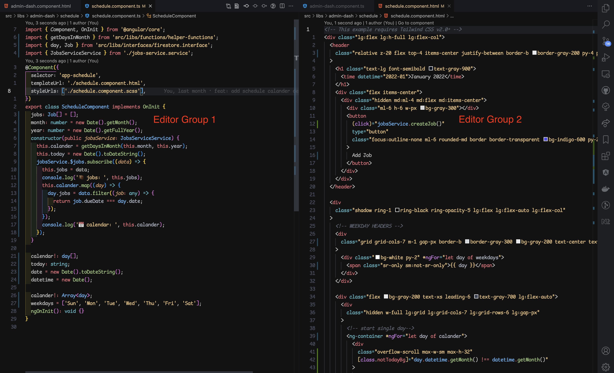

# Relevant-Files README

## Features

# HTML <-> TS
Toggle betwen html and typescript files.

1. navigate to an html file
2. cmd+shift+p to run the extension command

Finally, watch as the corresponding typescript file for the html opens to the side.

<!-- > Tip: Many popular extensions utilize animations. This is an excellent way to show off your extension! We recommend short, focused animations that are easy to follow. -->

## Requirements

* Have a good naming convention (Inspired by Angular Web Framework)
 
 Example:
  
  * home.component.html
  * home.component.ts
  * home.component.css/scss

## Extension Settings

## Known Issues

For Angular projects, while in a html file trying to open a ts file, sometimes the spec.ts file will open instead.

## Release Notes

### 1.0.0

Initial release of Relevant-Files

Command
* HTML<->TS : toggles between an html and typescript file.

### 1.2.0

No long required to start with 2 editors open.

Command Upate:

* goto -> htmlts : This command will switch between an html and typescript file.

### 1.3.0
* readme updates

### 1.4.0
 ### New Command Support for Angular
 * ->HTML : takes you to the relevant html file base on current file (must be in same folder)
 * ->TS: takes you to the relevant typescript file base on current file (must be in same folder)
 * ->SCSS: takes you to the relevant SCSS file base on current file (must be in same folder)
 * ->CSS: takes you to the relevant CSS file base on current file (must be in same folder)

 ### 1.5.0
 ### New Commands for general file linkes
    * ->createConfigFile : Creates a .relevantrc file to store all workspace file links
    * ->createFileLink : Creates a link between the current file open and another provided by the user
    * ->relevantLink : navigates the user to the linked file if available in relevantrc file

### Steps to get started with a config file
1. run the command "->createConfigFile" and select your workspace
2. navigate and open a file you wish to create a link for. 
3. navigate to a file you want to link to and copy the FILE PATH. (/Users/projects/sites/site1/file1)
4. now navigate to the file you want to add the link to.
5. run the command "->createFileLInk" and paste the file path you copied in the last step
6. run the command "->relevantLink" and expect to see the linke file open in the opposite editor
---

<!-- ## Following extension guidelines -->

<!-- Ensure that you've read through the extensions guidelines and follow the best practices for creating your extension. -->

<!-- * [Extension Guidelines](https://code.visualstudio.com/api/references/extension-guidelines) -->

## For more information

* [Repository For Relevant-Files](http://code.visualstudio.com/docs/languages/markdown)
<!-- * [Markdown Syntax Reference](https://help.github.com/articles/markdown-basics/) -->

**Enjoy!**
